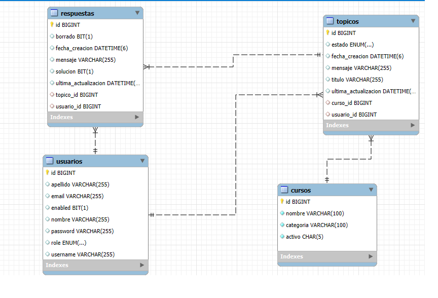
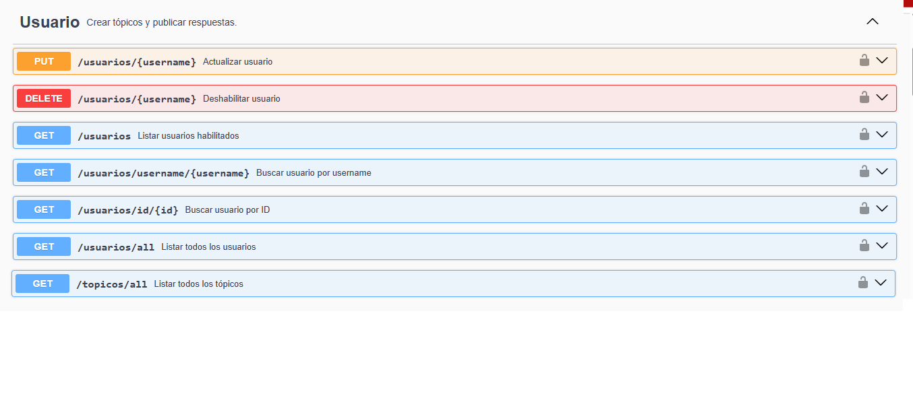
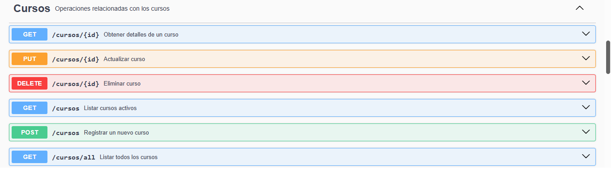
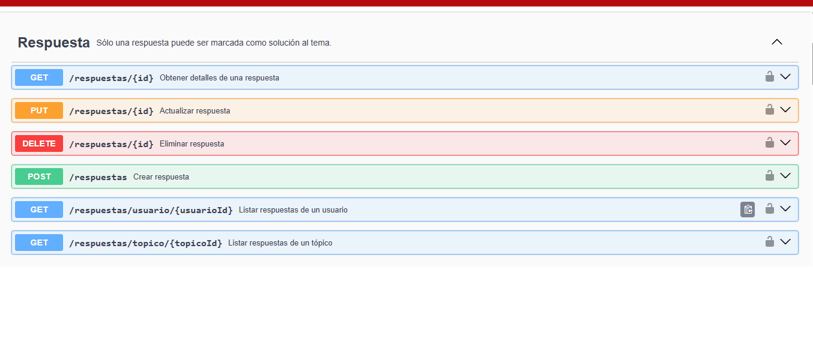
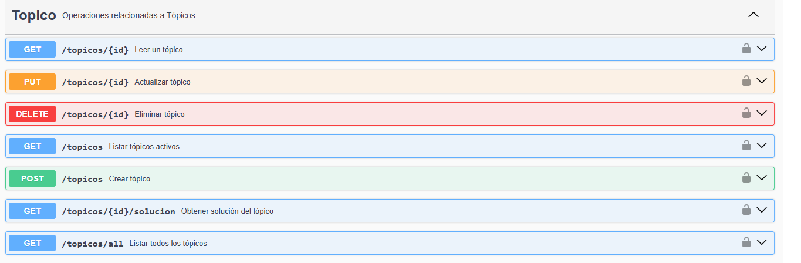
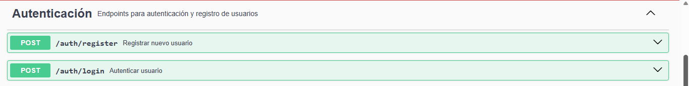

<div align="center">
  <h1 align="center">
    

  </h1>
</div>
<br> </br>

# 🎓 ForoHub API

API REST construida con **Spring Boot 3**, diseñada como un foro de discusión. Los usuarios pueden autenticarse. crear, leer, actualizar y eliminar tópicos (CRUD), respuestas a esos tópicos de acuerdo a los diferentes cursos y mantener la seguridad mediante **JWT (JSON Web Tokens)**.

---

## 🚀 Características

- Registro y autenticación de usuarios con **JWT**.
- Manejo de entidades principales:  
  - **Usuario** 👤  
  - **Curso** 📘  
  - **Tópico** 💬  
  - **Respuesta** 📝

- Seguridad implementada con **Spring Security** + **Filter JWT**.
- Persistencia con **Spring Data JPA** y **MySQL** (configurable).
- Migraciones de base de datos con **Flyway**.

---

## 🛠️ Tecnologías utilizadas

- Java 17 ☕
- Spring Boot 3
- Spring Security
- JPA / Hibernate
- Flyway
- JWT (Auth0 library)
- MySQL (o H2 para pruebas)


🛠️ Instalación y ejecución

Clonar el repositorio:

git clone [https://github.com/ginailyn/ChallegeForoHub.git](https://github.com/ginailyn/ChallegeForoHub.git)


Configurar la base de datos en application.properties:

Desarrollo y pruebas: La aplicación está configurada para usar H2 Database por defecto.
Producción: Actualiza las configuraciones en src/main/resources/application.properties con las credenciales de tu base de datos MySQL.

```java environment
spring.datasource.url=jdbc:mysql://localhost/foro_hub
spring.datasource.username=root
spring.datasource.password=tu_password
spring.jpa.hibernate.ddl-auto=update

```


## 🗄️ Estructura del proyecto

```
src/main/java/com/alura/desafios/apiForoHub/
│── domain/          # Entidades (Usuario, Curso, Topico, Respuesta)
│── infra/security/  # Seguridad y JWT (TokenService, SecurityFilter, etc.)
│── controller/      # Controladores REST
│── repository/      # Repositorios JPA
```
## Compilar y ejecutar la aplicación:

```
mvn spring-boot:run
```
Por defecto se ejecuta en http://localhost:8080.

## 📌 Endpoints principales
## 🔐 Autenticación

POST auth/login → Recibe usuario y contraseña, devuelve un token JWT.
```
{
  "token": "eyJhbGciOiJIUzI1NiIsInR..."
}

```
El token se debe enviar en el Auth del resto de los endpoints:
```
Authorization: Bearer <tu_token>
```
👤 Usuarios

- POST  auth/register → Registrar nuevo usuario.

- GET /usuarios/id/{id} → Obtener usuario por id.
  
- GET /usuarios → Mostrar usuarios activos.

- GET /usuarios/username/{username}  → Mostrar usuarios por userName.

- GET /usuarios/all → Mostrar todos los usuarios (activos o no).

- PUT /usuarios/{username} → Actualizar usuarios por userName.

- DELETE /usuarios/{username} → Deshabilitar o Eliminar usuarios lógicamente por userName.

📚 Cursos

- POST /cursos → Registrar un curso

- GET /cursos/{id} → Detalle de un curso
  
- GET /cursos → Mostrar cursos activos.

- GET /usuarios/all → Mostrar todos los cursos (activos o no).

- PUT /cursos/{id} → Actualizar los cursos.

- DELETE /cursos/{id} → Deshabilitar o Eliminar cursos lógicamente.


💬 Tópicos

- GET /topicos → Listar todos los tópicos.

- POST /topicos → Crear un nuevo tópico (requiere autenticación).

- GET /topicos/{id} → Ver detalle de un tópico.

- GET /topicos/{id}/solucion  → Obtener la respuesta marcada como solución de un tópico

- PUT /topicos/{id} →  Actualizar un tópico

- DELETE /topicos/{id} → Eliminar un tópico.

📝 Respuestas

- POST /respuestas → Crear respuesta en un tópico.

- GET /respuestas/{id} → Ver respuesta.

- GET /respuestas/usuario/{id} →  Mostrar las respuestas de un usuario.
 
- GET /respuestas/topico/{id} →  Mostrar las respuestas de un tópico.
    

🧪 Pruebas con Insomnia / Postman

- Registrar usuario → POST auth/register

- Iniciar sesión → POST auth/login

-- → Guardar el token JWT de la respuesta.


# Hacer peticiones a endpoints protegidos enviando en Auth:
```
Authorization: Bearer <token>
```
Acceder a la API en:
http://localhost:8080/swagger-ui/index.html


## 🌟 Base de Datos  Tablas  🌟

## 📝 Tablas DB 📝



## 📝 API Documentación 📝






## 🔐 Autenticación y Autorización
La API usa Spring Security para la autenticación y autorización. Los usuarios deben autenticarse para acceder a los endpoints.
---

## Autor: ✒️

* **Gina Arias** -
* **Linkedin* - ((https://www.linkedin.com/in/gina-a-arias-aranguren-882098133/))
* **Github* - ([(https://github.com/ginailyn)](https://github.com/ginailyn))

## 🤝 Redes sociales 🤝

<h3 align="left">Connect with me</h3>

<a href="https://www.linkedin.com/in/[tu-usuario-linkedi](https://www.linkedin.com/in/gina-a-arias-aranguren-882098133/)/" target="_blank">  </a> <a href="https://github.com/[tu-usuario-github](https://github.com/ginailyn)" target="_blank">  </a>
